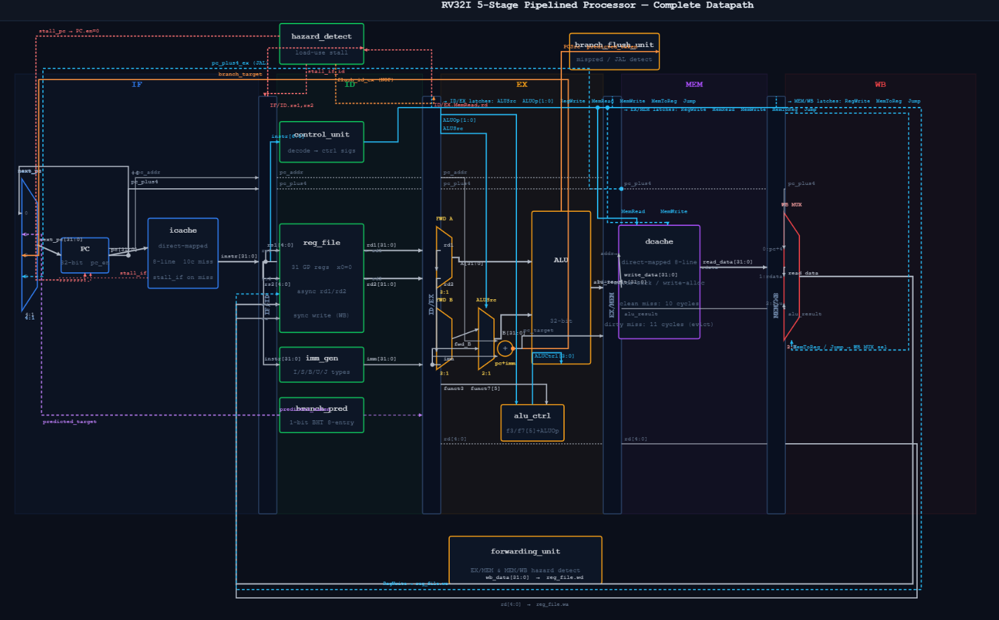

# RISC-V 5-Stage Pipelined CPU

A 5-stage pipelined RV32I processor implemented in SystemVerilog. The pipeline sustains single-cycle throughput on non-hazard instructions and handles all three hazard classes — data, control, and structural — through forwarding, stalling, and branch prediction. Separate direct-mapped L1 instruction and data caches sit in front of instruction and data memory. Verified with self-checking cocotb testbenches simulated under Verilator.

---

## Architecture



The datapath is divided into five pipeline stages connected by four pipeline registers. Three hazard-handling units — the forwarding unit, hazard detection unit, and branch flush unit — monitor inter-stage signals and control stalling and flushing independently. Two caches intercept memory accesses before they reach the backing stores.

```
 ┌──────────────────────────────────────────────────────────────────────────────────────────────────┐
 │                                  HAZARD / CONTROL PLANE                                          │
 │  ┌───────────────────────┐     ┌───────────────────────────┐     ┌───────────────────────────┐   │
 │  │    hazard_detect      │     │      forwarding_unit      │     │    branch_flush_unit      │   │
 │  │   (load-use stall)    │     │      (EX/MEM, MEM/WB)     │     │    (mispredict flush)     │   │
 │  └───────────────────────┘     └───────────────────────────┘     └───────────────────────────┘   │
 └──────────────────────────────────────────────────────────────────────────────────────────────────┘

 ┌──────────┐  IF/ID  ┌──────────────┐  ID/EX  ┌──────────────┐  EX/MEM  ┌──────────┐  MEM/WB  ┌──────────┐
 │    IF    ├────────►│      ID      ├────────►│      EX      ├─────────►│   MEM    ├─────────►│    WB    │
 ├──────────┤         ├──────────────┤         ├──────────────┤          ├──────────┤          ├──────────┤
 │ icache   │         │ control_unit │         │ alu          │          │ dcache   │          │ reg_file │
 │ instr_mem│         │ imm_gen      │         │ alu_control  │          │ data_mem │          │          │
 │          │         │ reg_file     │         │ forwarding   │          │          │          │          │
 │          │         │ branch_pred  │         │ muxes        │          │          │          │          │
 └──────────┘         └──────────────┘         └──────────────┘          └──────────┘          └──────────┘
```

### Pipeline Stage Summary

| Stage | Abbrev | Key Work |
|-------|--------|----------|
| Instruction Fetch | IF | PC → icache → instruction word |
| Instruction Decode | ID | Register read, immediate generation, control signals, branch prediction |
| Execute | EX | ALU operation, branch resolution, forwarding mux select |
| Memory Access | MEM | dcache read/write, branch flush decision |
| Write Back | WB | Register file write |

---

## Hazard Handling

### Data Hazards — Forwarding

The forwarding unit resolves read-after-write hazards by bypassing the register file. It monitors the destination registers in EX/MEM and MEM/WB and drives 2-bit mux selects (`forward_a`, `forward_b`) into the ALU input muxes.

```
forward_a / forward_b encoding:
  2'b00 — use register file output (id_ex_rd1 / id_ex_rd2)
  2'b01 — forward from MEM/WB (wb_result)
  2'b10 — forward from EX/MEM (ex_mem_alu_result)
```

EX/MEM forwarding takes priority over MEM/WB when both match (handles the case where two consecutive instructions both write the same register).

### Data Hazards — Load-Use Stall

A forwarding path cannot resolve a load followed immediately by a dependent instruction — the load data does not exist until after MEM, one cycle too late for EX forwarding.

The hazard detection unit detects this condition:
```
if (id_ex_MemRead && (id_ex_rd == if_id_rs1 || id_ex_rd == if_id_rs2))
```
When triggered:
- PC is stalled (frozen)
- IF/ID is stalled (frozen)
- ID/EX is flushed (NOP bubble inserted into EX)

This introduces a single-cycle stall, after which the forwarding unit resolves the hazard normally via the MEM/WB path.

### Control Hazards — Branch Prediction

Branches are resolved in the EX stage. Without prediction, every taken branch would waste two cycles (the IF and ID stages already fetched incorrect instructions). The branch predictor eliminates this overhead on correct predictions.

**Branch History Table (BHT):**
- 16 entries, each a 2-bit saturating counter
- Indexed by `pc[5:2]` (bits 5:2 of the branch instruction's PC)
- Prediction made in ID stage; BHT updated in EX stage on branch resolution
- Initialized to `2'b01` (weakly not taken) on reset

```
Counter states:
  2'b00  Strongly Not Taken
  2'b01  Weakly Not Taken   ← reset state
  2'b10  Weakly Taken
  2'b11  Strongly Taken
```

**Prediction outcome:**
- **Correct prediction, not taken:** 0 penalty cycles — the sequentially fetched instruction was correct
- **Correct prediction, taken:** 1 penalty cycle — `predict_taken=1` fires in ID and immediately redirects the PC to the branch target, but the instruction already in IF (fetched at PC+4 before the prediction was known) must be discarded; only IF/ID is flushed
- **Misprediction:** 2-cycle penalty — the PC is redirected in EX; both IF/ID and ID/EX are flushed, discarding the two instructions already fetched down the wrong path

No branch target buffer (BTB) is needed because the branch target (PC + imm) is computed in the ID stage alongside the prediction — both are available at the same time.

**Jump instructions (JAL/JALR)** have a 2-cycle penalty, the same as a misprediction. Unlike branches, jumps are not fed through the branch predictor — the PC redirect only happens when the jump reaches EX (`id_ex_Jump=1`). At that point two wrong instructions have already entered the pipeline (PC+4 in ID, PC+8 in IF). The branch_flush_unit fires and flushes both IF/ID and ID/EX, discarding both.

The branch flush unit fires on:
```
(id_ex_Branch && (branch_taken XOR id_ex_predicted_taken)) || id_ex_Jump
```

---

## Memory Hierarchy

Both caches are 256B, direct-mapped, with one 32-bit word per block. The address is decoded as:

```
[31:8] tag  (24 bits)
 [7:2] index (6 bits → 64 lines)
 [1:0] block offset (always 2'b00, word-aligned)
```

### L1 Instruction Cache (icache)

- **Organization:** 256B, 64 lines, 4B/line, direct-mapped
- **Policy:** Read-only (instructions are never written)
- **Hit latency:** 1 cycle (combinational read)
- **Miss penalty:** 10 cycles (models DRAM access delay)
- **Stall behavior:** On miss, stalls only the PC for 10 cycles; the icache outputs instr=0 (NOP) during a miss so IF/ID continues flowing harmlessly without an explicit stall

On a miss, `stall=1` and `mem_read=1` are asserted, freezing the front of the pipeline while the backing `instr_mem` fulfills the fetch. After 10 cycles the cache line is filled and `stall` deasserts.

### L1 Data Cache (dcache)

- **Organization:** 256B, 64 lines, 4B/line, direct-mapped
- **Policy:** Write-back, write-allocate
- **Hit latency:** 1 cycle (combinational read; synchronous write)
- **Clean miss penalty:** 10 cycles
- **Dirty eviction penalty:** 11 cycles (1-cycle writeback + 10-cycle fetch)

**Stall behavior on miss:** stalls PC, IF/ID, ID/EX, and EX/MEM (freezing the load/store in MEM); flushes MEM/WB to prevent the WB stage from seeing and committing stale data from a previous cycle.

**Dirty eviction sequence:**

When a miss is detected and the resident line is dirty, the cache enters a two-phase sequence controlled by the `writeback_pending` flag:

1. **Writeback cycle (1 cycle):** `writeback_pending` asserted; `mem_write=1` driven to data memory. The writeback address is reconstructed from the stored tag and index: `{tag[index], index, 2'b00}`. `writeback_pending` cleared and `dirty` bit cleared at the end of this cycle.
2. **Fetch phase (10 cycles):** Clean miss proceeds normally; new data loaded into the cache line.

**Write-allocate on store miss:** After the 10-cycle fetch, the cache is filled with `write_data` (not `mem_data`) and the dirty bit is set — the store data is placed directly without a second write cycle.

---

## Two-Stage ALU Decode

ALU operation is determined in two stages:

1. **`control_unit`** outputs a 2-bit `ALUOp` based on the opcode:

| ALUOp | Meaning |
|-------|---------|
| `2'b00` | Force ADD (load/store address: rs1 + imm) |
| `2'b01` | Branch compare (decoded from funct3 in alu_control) |
| `2'b10` | R-type (decoded from funct3 + funct7[5]) |
| `2'b11` | I-type ALU (decoded from funct3 only; SRLI/SRAI distinguished by funct7[5]) |

2. **`alu_control`** uses `ALUOp`, `funct3`, and `funct7_5` to select the final 4-bit ALU operation.

R-type and I-type are given separate `ALUOp` values (`10` vs `11`) to prevent negative immediates from being misread as `funct7[5]=1` (which would decode ADDI as SUB).

---

## Modules

| Module | File | Description |
|--------|------|-------------|
| `riscv_core` | `rtl/core/riscv_core.sv` | Top-level datapath wiring |
| `pc` | `rtl/core/pc.sv` | Program counter with stall and synchronous reset |
| `instr_mem` | `rtl/core/instr_mem.sv` | 256-word instruction ROM |
| `icache` | `rtl/core/icache.sv` | 256B direct-mapped L1 instruction cache |
| `dcache` | `rtl/core/dcache.sv` | 256B direct-mapped L1 data cache, write-back/write-allocate |
| `control_unit` | `rtl/core/control_unit.sv` | Main control signal decoder |
| `alu_control` | `rtl/core/alu_control.sv` | Two-stage ALU operation decoder |
| `alu` | `rtl/core/alu.sv` | 10-operation arithmetic logic unit |
| `reg_file` | `rtl/core/reg_file.sv` | 32×32 register file, x0 hardwired to 0 |
| `imm_gen` | `rtl/core/imm_gen.sv` | Immediate sign-extension for all RV32I formats |
| `data_mem` | `rtl/core/data_mem.sv` | 256-word data RAM (word-aligned, synchronous write) |
| `if_id_reg` | `rtl/core/if_id_reg.sv` | IF/ID pipeline register with stall and flush |
| `id_ex_reg` | `rtl/core/id_ex_reg.sv` | ID/EX pipeline register with stall and flush |
| `ex_mem_reg` | `rtl/core/ex_mem_reg.sv` | EX/MEM pipeline register with stall |
| `mem_wb_reg` | `rtl/core/mem_wb_reg.sv` | MEM/WB pipeline register with flush |
| `forwarding_unit` | `rtl/core/forwarding_unit.sv` | EX/MEM and MEM/WB forwarding path control |
| `hazard_detection_unit` | `rtl/core/hazard_detection_unit.sv` | Load-use hazard detection and stall generation |
| `branch_predictor` | `rtl/core/branch_predictor.sv` | 16-entry 2-bit saturating counter BHT |
| `branch_flush_unit` | `rtl/core/branch_flush_unit.sv` | Misprediction and jump flush control |
| `riscv_pkg` | `rtl/common/riscv_pkg.sv` | Shared constants, opcodes, funct3/7, ALU codes |

---

## Pipeline Register Control

Each pipeline register responds to stall and/or flush signals from the hazard units:

| Register | Stall source | Flush source |
|----------|-------------|-------------|
| PC | load-use stall, icache stall, dcache stall | — |
| IF/ID | load-use stall, dcache stall | branch flush (misprediction / jump), predict_taken (correct taken branch) |
| ID/EX | dcache stall | load-use bubble (flush_id_ex), branch flush (misprediction / jump) |
| EX/MEM | dcache stall | — |
| MEM/WB | — | dcache stall |

On stall, a register holds its current value. On flush, a register zeroes all outputs (NOP propagates forward).

Key distinctions:
- **Load-use hazard** stalls PC and IF/ID (freezing them) and flushes ID/EX (inserting a bubble into EX). ID/EX does not stall — it flushes.
- **Correct taken branch** (`predict_taken=1`) flushes only IF/ID — the redirect happens in ID so only the one instruction already in IF is wrong.
- **Misprediction or jump** (`branch_flush=1`) flushes both IF/ID and ID/EX — the redirect happens in EX so two instructions are wrong.
- **icache stall** only freezes the PC. IF/ID keeps receiving the icache output (which is 0/NOP during a miss), so no explicit IF/ID stall is needed.

---

## Supported Instructions

### R-Type
| Instruction | Operation |
|-------------|-----------|
| `add` | rd = rs1 + rs2 |
| `sub` | rd = rs1 - rs2 |
| `sll` | rd = rs1 << rs2[4:0] |
| `slt` | rd = (rs1 < rs2) signed |
| `sltu` | rd = (rs1 < rs2) unsigned |
| `xor` | rd = rs1 ^ rs2 |
| `srl` | rd = rs1 >> rs2[4:0] |
| `sra` | rd = rs1 >>> rs2[4:0] |
| `or` | rd = rs1 \| rs2 |
| `and` | rd = rs1 & rs2 |

### I-Type (ALU Immediate)
`addi`, `slti`, `sltiu`, `xori`, `ori`, `andi`, `slli`, `srli`, `srai`

### I-Type (Load)
| Instruction | Supported |
|-------------|-----------|
| `lw` | Yes |
| `lb`, `lh`, `lbu`, `lhu` | Not implemented |

### S-Type (Store)
| Instruction | Supported |
|-------------|-----------|
| `sw` | Yes |
| `sb`, `sh` | Not implemented |

### B-Type (Branch)
`beq`, `bne`, `blt`, `bge`, `bltu`, `bgeu`

### U-Type
`lui`, `auipc`

### J-Type
`jal`, `jalr`

> Byte and halfword memory operations (`lb`, `lh`, `lbu`, `lhu`, `sb`, `sh`) are not implemented. Data memory supports 32-bit word-aligned accesses only.

---

## Project Structure

```
.
├── rtl/
│   ├── common/
│   │   └── riscv_pkg.sv            # Shared package: opcodes, funct3/7, ALU codes
│   └── core/
│       ├── riscv_core.sv           # Top-level core, all datapath wiring
│       ├── pc.sv                   # Program counter
│       ├── instr_mem.sv            # Instruction ROM
│       ├── icache.sv               # L1 instruction cache
│       ├── dcache.sv               # L1 data cache
│       ├── control_unit.sv         # Main decode, control signal generation
│       ├── alu_control.sv          # Two-stage ALU op decode
│       ├── alu.sv                  # Arithmetic/logic unit
│       ├── reg_file.sv             # Register file
│       ├── imm_gen.sv              # Immediate sign-extension
│       ├── data_mem.sv             # Data RAM
│       ├── if_id_reg.sv            # IF/ID pipeline register
│       ├── id_ex_reg.sv            # ID/EX pipeline register
│       ├── ex_mem_reg.sv           # EX/MEM pipeline register
│       ├── mem_wb_reg.sv           # MEM/WB pipeline register
│       ├── forwarding_unit.sv      # Data forwarding mux control
│       ├── hazard_detection_unit.sv# Load-use hazard detection
│       ├── branch_predictor.sv     # 2-bit saturating counter BHT
│       └── branch_flush_unit.sv    # Misprediction/jump flush logic
└── tb/
    ├── imm_gen/                    # Immediate generator unit test
    ├── reg_file/                   # Register file unit test
    ├── data_mem/                   # Data memory unit test
    └── core/                       # Integration testbenches
        ├── test_riscv_core_single_cycle.py     # Baseline hazard-free test
        ├── test_riscv_core_hazardless.py       # No-hazard instruction mix
        ├── test_riscv_core_data_hazards.py     # EX/MEM and MEM/WB forwarding
        ├── test_riscv_core_load_use_hazards.py # Load-use stall + forwarding
        ├── test_riscv_core_branch_flush.py     # Branch misprediction flush
        ├── test_riscv_core_jumps.py            # JAL/JALR
        ├── test_riscv_core_lui_auipc.py        # LUI/AUIPC
        ├── test_riscv_core_integration_test.py # Full instruction mix
        ├── test_riscv_core_branch_predictor.py # BHT prediction and update
        ├── test_riscv_core_icache.py           # icache hit/miss/stall
        ├── test_riscv_core_dcache.py           # dcache hit/miss/dirty eviction
        ├── Makefile
        └── programs/
            ├── asm/                # RISC-V assembly source files
            └── hex/                # Assembled hex files loaded by testbenches
```

---

## Running Tests

### Dependencies
- [Verilator](https://verilator.org) — SystemVerilog simulator
- [cocotb](https://www.cocotb.org) — Python-based HDL verification framework
- `riscv64-unknown-elf` toolchain — for assembling test programs

### Integration Tests

Each test targets a specific behavior. Select the test by setting the `MODULE` variable:

```bash
cd tb/core

# Forwarding paths
MODULE=test_riscv_core_data_hazards make

# Load-use stall
MODULE=test_riscv_core_load_use_hazards make

# Branch misprediction flush
MODULE=test_riscv_core_branch_flush make

# Branch predictor
MODULE=test_riscv_core_branch_predictor make

# Instruction cache
MODULE=test_riscv_core_icache make

# Data cache (hit, miss, dirty eviction, write-allocate)
MODULE=test_riscv_core_dcache make

# Full integration
MODULE=test_riscv_core_integration_test make
```

Waveforms are written to `dump.vcd` and can be viewed in GTKWave:
```bash
gtkwave dump.vcd
```

### Unit Tests

```bash
cd tb/imm_gen && make
cd tb/reg_file && make
cd tb/data_mem && make
```

### Assembling Test Programs

Test programs are written in RISC-V assembly and assembled using the included script:
```bash
cd tb/core/programs
./assemble.sh <program_name>
# e.g. ./assemble.sh dcache
```
This produces `.o`, `.elf`, and `.hex` files. Only `.hex` files are loaded by the testbenches.

---

## Tools

| Tool | Purpose |
|------|---------|
| SystemVerilog | RTL implementation language |
| Verilator | Linting and simulation |
| cocotb | Python testbench framework |
| GTKWave | Waveform viewer |
| riscv64-unknown-elf | RISC-V assembler and linker |
